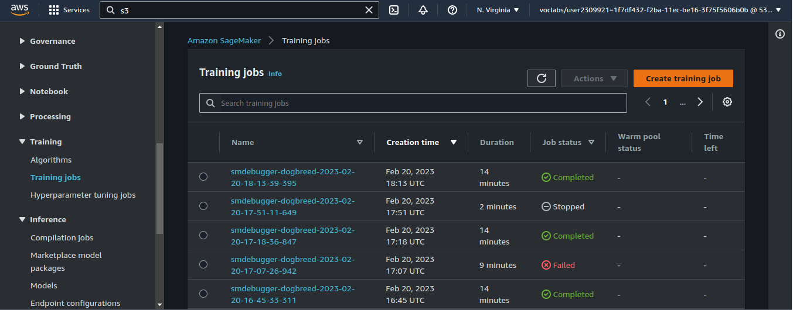

# Image Classification using AWS SageMaker

Use AWS Sagemaker to train a pretrained model that can perform image classification by using the Sagemaker profiling, debugger, hyperparameter tuning and other good ML engineering practices. This can be done on either the provided dog breed classication data set or one of your choice.

## Project Set Up and Installation
Enter AWS through the gateway in the course and open SageMaker Studio. 
Download the starter files.
Download/Make the dataset available. 

## Dataset
The provided dataset is the dogbreed classification dataset which can be found in the classroom.
The project is designed to be dataset independent so if there is a dataset that is more interesting or relevant to your work, you are welcome to use it to complete the project.

### Access
Upload the data to an S3 bucket through the AWS Gateway so that SageMaker has access to the data. 

## Hyperparameter Tuning
What kind of model did you choose for this experiment and why? Give an overview of the types of parameters and their ranges used for the hyperparameter search

I chose resnet18 model for this project

Remember that your README should:
Training Jobs:

 

Metrics Logging:
- Metrics logged during training include epoch number, train-loss, test-loss and accuracy

No. of hyperparameters Tuned:
- 3 hyperparameters tuned and these hyperparameters are batch-size,epochs,learning-rate 

Best Hyperparameters from hyperparameter tuning jobs:
- 'batch-size': 64, 'epochs': 2, 'lr': 0.02504110549124806

## Debugging and Profiling
Debugging and Profiling Rules are defined using sagemaker utility.
Debugging rules include vanishing_gradient,overfit,overtraining,poor_weight_initialization are used for improving model's performance.
Profiling Rules include loss_not_decreasing, LowGPUUtilization. In this project no gpu instance was used for GPU Utilitzation is zero
Then, Debug hook and profile config is defined. Debug hook is used for identifying and diagnosing any issues affecting model performance and profiling config is used for collecting resources metrics to identify potential bottlenecks during training process.
   

### Results
**TODO**: What are the results/insights did you get by profiling/debugging your model?

**TODO** Remember to provide the profiler html/pdf file in your submission.

## Model Deployment
After training the model, model is deployed to an Endpoint for inference. 
Method for deploying Endpoint:

PytorchModel is used for deployment of model to an Endpoint. 
Arguments:
1. Entry_point:
It takes inference.py (python file for loading the model and classifying input image) as argument where functions like model_fn, input_fn, predict_fn and output_fn are defined. 
2. Source_dir:
Path of inference.py file
3. Role:
Execution role
4. Model:
Path to Model Artifact

**TODO** Remember to provide a screenshot of the deployed active endpoint in Sagemaker.
